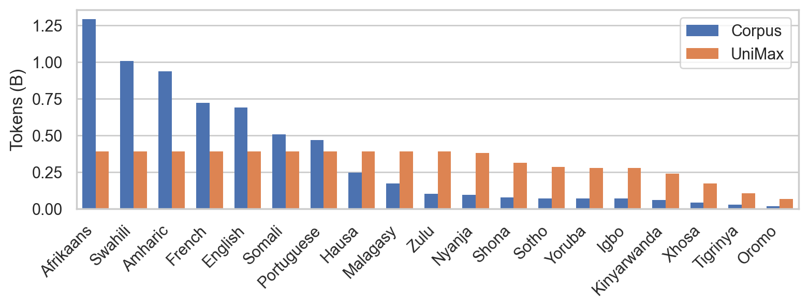
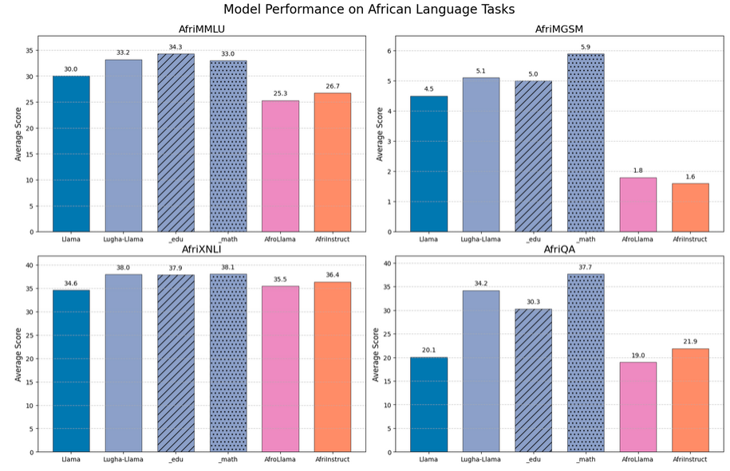
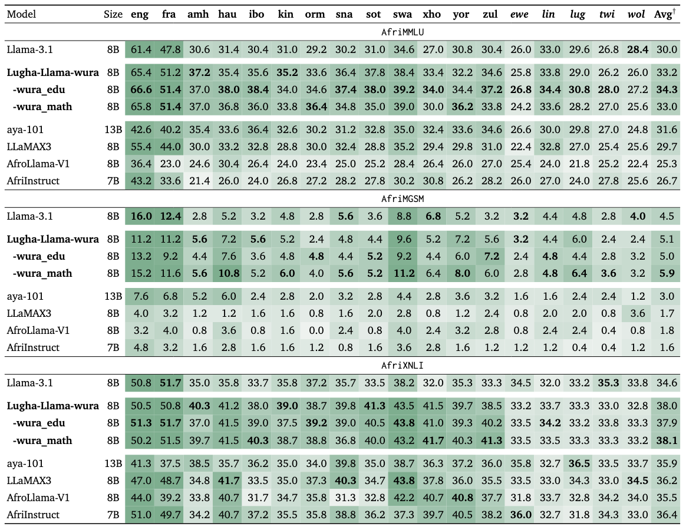

### Lugha-Llama: Adapting Large Language Models for African Languages

[Happy Buzaaba](https://buzaabah.github.io/)<sup>1</sup>, [Alexander Wettig](https://www.cs.princeton.edu/~awettig/)<sup>1</sup>, [David Ifeoluwa Adelani](https://dadelani.github.io/)<sup>2</sup>, [Christiane Fellbaum](https://www.cs.princeton.edu/people/profile/fellbaum)<sup>1</sup>

<sup>1</sup>Princeton University
<sup>2</sup>Mila, McGill University & Canada CIFAR AI Chair

-----------------------------------------------------------------------------------------------

Low-resource african languages remain underrepresented in the large training datasets of large language models (LLMs) and, as a result, LLMs struggle to understand these languages.
We are releasing three African-centric **Lugha-Llama** models based on [Llama-3.1-8B](https://huggingface.co/meta-llama/Llama-3.1-8B), which achieve the *best performance* among open-source models on
[IrokoBench](https://arxiv.org/abs/2406.03368), a challenging African languages benchmark and [AfriQA](https://arxiv.org/abs/2305.06897), a cross-lingual open-retrieval question answering dataset for African languages (Lugha is the Kiswahili word for "language").

All Lugha-Llama models are available on 🤗 [**huggingface hub**](https://huggingface.co/Lugha-Llama).

In this blog post, we describe the training setting and data for producing Lugha-Llama.

## What data is used to train Lugha-Llama?

We rely on an openly available multilingual <a href="https://aclanthology.org/2023.emnlp-main.11.pdf">WURA</a> corpus of African languages to train our models. The corpus comprises of sixteen African languages and four high-resource languages commonly spoken on the African continent. It was collected by carefuly inspecting and cleaning mC4 and crawling African websites. It also includes 3 languages with non-latin scripts, namely Amharic, Arabic and Tigirinya. 

### The WURA corpus

One of the challenges of multilingual model pre-training is data imbalance. Given an imbalanced multilingual corpus like WURA, it is important to carefully control how many times a dataset can be repeated during training to avoid overfitting and memorization.

To address this, we sample from 19 languages in WURA corpus using [UniMax sampling](https://arxiv.org/abs/2304.09151) which attempts to sample as uniformaly as possible across languages while controling the extent of data repeats for any language. Rare languages were up-sampled by at most four epochs which was found to incur no discernible degradation during model training [[Muennighoff et al.,](https://openreview.net/pdf?id=j5BuTrEj35)]. 

The figure below shows tokens per language in our training corpus and the sampling proportations using unimax sampling.
<p align="center">
  
</p>

### Adding English language data
We continue training Llama-3.1-8B, which was predominantly trained on English data. To prevent catastrophic forgetting of the pre-trained capabilities of the model, we explore retaining English data in the continued pre-training data mix. We experiment with two different sources of English data:

1. [FineWeb-Edu](https://huggingface.co/datasets/HuggingFaceFW/fineweb-edu) which contains high-quality and knowledge-rich educational documents.
2. [OpenWebMath](https://huggingface.co/datasets/open-web-math/open-web-math) a curated dataset of mathematical documents. In these experiments, we combine 40% of English data with 60% of the WURA data. This kind of "replay" has been shown to be effective in preventing catastrophic forgetting in continued pre-training [[Ibrahim et al.,](https://arxiv.org/abs/2403.08763)].


## Lugha-Llama Models
Unlike prior African language models, we continue pre-training a much larger model (8B parameters) on a substantially more text (10B tokens). We open-source three models:
<!--
Lugha-Llama models were obtained by adapting Llama-3.1-8B model to 16 low-resource African languages and 3 high-resource languages commonly spoken on the African continent namely: English, French and Portuguese. 

Some existing studies have attempted to adapt multilingual models to low-resource African languages through instruction tuning [AFRINSTRUCT](https://aclanthology.org/2024.findings-emnlp.793.pdf) and continued pre-training [AfroLlama_V1](https://huggingface.co/Jacaranda/AfroLlama_V1). Unlike previous attempts, Lugha-Llama models were trained on WURA corpus with three different data mixtures: 
-->

1. [Lugha-Llama-8B-wura](https://huggingface.co/Lugha-Llama/Lugha-Llama-8B-wura): Trained exclusively on the WURA corpus and therefore with the most amount of African language data.
<!--
We sample 10B tokens from WURA corpus and continue to pre-train on Llama-3.1-8B using a batch size of 512 sequences containing 8192 tokens each. 
-->
2. [Lugha-Llama-8B-wura_edu](https://huggingface.co/Lugha-Llama/Lugha-Llama-8B-wura_edu): Trained on a mix of African language data and educational English documents from [FineWeb-Edu](https://huggingface.co/datasets/HuggingFaceFW/fineweb-edu).
<!--
Given that the base model Llama-3.1-8B is predominently English, we add some English data to prevent catastrophic forgetting. We combine 6B tokens from WURA corpus with 4B tokens from [FineWeb-Edu](https://huggingface.co/datasets/HuggingFaceFW/fineweb-edu) high-quality English Educational documents. 
-->
3. [Lugha-Llama-8B-wura_math](https://huggingface.co/Lugha-Llama/Lugha-Llama-8B-wura_math): Trained on a mix of African language data and English mathematical data from [OpenWebMath](https://huggingface.co/datasets/open-web-math/open-web-math).
<!--
To boost the mathematical reasoning abilities of African language models, We combine 6B tokens from WURA corpus with 4B tokens from [OpenWebMath](https://huggingface.co/datasets/open-web-math/open-web-math) dataset which contains documents with mathematical content. 
-->
All models are trained on batch sizes of 4M tokens with a maximum sequence length of 8192 tokens for 2400 steps.

### Evaluation
We make use of the [LM Evaluation Harness](https://github.com/EleutherAI/lm-evaluation-harness) to evaluate on [AfriQA](https://arxiv.org/abs/2305.06897) and on three tasks in [Irokobench](https://arxiv.org/abs/2406.03368) ie: knowledge-based question answering (AfriMMLU),  mathematical reasoning (AfriMGSM), natural language inference (AfriXNLI) 

 - All three Lugha-Llama models consistently achieve the best performance across AfriMMLU, AfriMGSM, AfriXNLI and AfriQA amongst similarly sized baselines.

- Including data from FineWeb-Edu (_edu) consistently boosts the performance across languages in AfriMMLU and including English data from OpenWebMath (_math) improves performance in AfriMGSM, suggesting some cross-lingual transfer of skills and knowledge.
<!--
- Lugha-Llama models significantly outperform the base model by more than 10% and consistently outperforms similarly sized Africa-centric language models on the cross- lingual question answering benchmark AfriQA.
--> 

<p align="center">
  
</p>


The table below shows a detailed comparision of Lugha-Llama models to the baselines per language for all three tasks in IrokoBench. The languages in italic are not present in the continual pre-training data. † indicates average values without English (eng) and French (fra)
- Adapting the pre-trained model to African languages increases AfriMMLU scores by up to 8 percentage points compared to Llama-3.1-8B, with the largest improvements in Igbo (ibo) language.

</p>
<p align="center">
  
</p>


### Conclusion and Future directions

We introduce three groundbreaking Lugha-Llama models, leveraging continued pre-training to advance research in low-resource African languages. Our models achieve state-of-the-art results across challenging IrokoBench tasks and the cross-lingual AfriQA dataset. Our findings reveals that integrating African language pre-training data with carefully curated, high-quality English documents from FineWeb-Edu and OpenWeb-Math substancially improves downstream task performance. This work represents a significant contribution in realizing the vision of greater representation for African languages in NLP, LLMs and broader AI research.

Looking ahead, promissing future directions include a deeper investigation into linguistic transfer mechanisms and assessing the impact of integrating high-quality non-English data from [FineWeb2](https://github.com/huggingface/fineweb-2) for achieving similar improvements.

### Citation
If you are using the Lugha Llama models, please cite our blog post!
```bibtex
@article{buzaaba2025lugha,
  title={Lugha-Llama: Adapting Large Language Models for African Languages},
  author={Buzaaba, Happy and Wettig, Alexander and Adelani, David Ifeoluwa and Fellbaum, Christiane},
  journal={arXiv preprint arXiv:2504.06536},
  year={2025}
}
```

